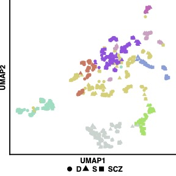
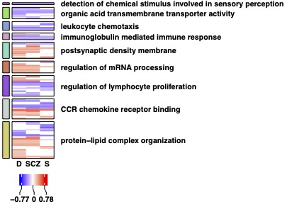

<!-- README.md is generated from README.Rmd. Please edit that file -->

```{r, include = FALSE}
knitr::opts_chunk$set( # nolint: extraction_operator_linter.
  collapse = TRUE,
  comment = "#>",
  fig.path = "man/figures/README-", # nolint: nonportable_path_linter.
  out.width = "100%"
)
```

# PAVER: Pathway Analysis Visualization with Embedding Representations

<!-- badges: start -->
[](https://github.com/willgryan/PAVER/actions/workflows/rworkflows.yml)
[](https://github.com/willgryan/PAVER/blob/main/LICENSE.md)
[](https://github.com/willgryan/PAVER/releases/latest)

[](https://doi.org/10.5281/zenodo.8156248)
[](https://doi.org/10.6026/973206300200700)

[](https://www.bioinformation.net/020/973206300200700.pdf)
[](https://www.bioinformation.net/020/973206300200700.htm)
<!-- badges: end -->

PAVER allows for summary interpretation and visualization of pathway analyses.

## Usage

PAVER is designed to work with the output of pathway analysis tools. The package includes a vignette with an example dataset that explains it's functionality. The R Shiny application for the PAVER R package is hosted at [https://cdrl.shinyapps.io/PAVER/](https://cdrl.shinyapps.io/PAVER/). For more detailed information on PAVER and its functionalities, please read further below and also refer to the article on the Cognitive Disorders Research Laboratory (CDRL) website [here](https://cdrl-ut.org/project/projects_and_posters/paver/).

## Downloads

You may download the latest source release for PAVER [here](https://github.com/willgryan/PAVER/releases/latest). You may also download the latest release of the R Shiny app for the PAVER R package [here](https://github.com/willgryan/PAVER_shiny/releases/latest).

Pre-computed pathway embeddings for use with PAVER are available for download [here](https://github.com/willgryan/PAVER_embeddings).

## Installation

You can install the development version of PAVER from [GitHub](https://github.com/) with:

``` r
if (!requireNamespace("remotes", quietly = TRUE))
    install.packages("remotes")
remotes::install_github("willgryan/PAVER")
```

## Example

PAVER offers different visualizations for exploring and interpreting pathway clusters.

The theme plot is a scatter plot showing all pathways in the dataset, colored by theme. The theme plot is useful for identifying pathways that are similar to each other, and for identifying pathways that are outliers. The theme plot can be generated using the `PAVER_theme_plot` function.

[](man/figures/README-theme_plot.jpg)

The heatmap plot shows the enrichment scores for each pathway in each cluster. The heatmap plot is useful for quantitatively identifying identifying differences in pathway regulation across different pathway analyses. The heatmap plot can be generated using the `PAVER_hunter_plot` function.

[](man/figures/README-hunter_plot.jpg)

## Authors

- **William G Ryan V** - E-mail: [William.Ryan2@rockets.utoledo.edu](mailto:William.Ryan2@rockets.utoledo.edu)
- **Ali Sajid Imami** - E-mail: [Ali.Imami@rockets.utoledo.edu](mailto:Ali.Imami@rockets.utoledo.edu)
- **Hunter Eby** - E-mail: [Hunter.Eby@rockets.utoledo.edu](mailto:Hunter.Eby@rockets.utoledo.edu)
- **John Vergis** - E-mail: [John.Vergis@utoledo.edu](mailto:John.Vergis@utoledo.edu)
- **Xiaolu Zhang** - E-mail: [xiaolu.zhang@lsuhs.edu](mailto:xiaolu.zhang@lsuhs.edu)
- **Jarek Meller** - E-mail: [mellerj@ucmail.uc.edu](mailto:mellerj@ucmail.uc.edu)
- **Rammohan Shukla** - E-mail: [rshukla@uwyo.edu](mailto:rshukla@uwyo.edu)
- **Robert McCullumsmith** - E-mail: [robert.mccullumsmith@utoledo.edu](mailto:robert.mccullumsmith@utoledo.edu)

## Acknowledgements

PAVER was supported by NIH NIGMS T32-G-RISE grant number 1T32GM144873-01, NIH NIMH grant number R01MH107487, NIH NIMH grant number R01MH121102, and NIH NIA grant number R01AG057598.

## Contact

For technical issues, please start a new issue on this [repository](https://github.com/willgryan/PAVER/issues). For technical questions, please contact [William.Ryan2@rockets.utoledo.edu](mailto:William.Ryan2@rockets.utoledo.edu).

For the corresponding author, please contact [robert.mccullumsmith@utoledo.edu](mailto:robert.mccullumsmith@utoledo.edu).

## Citation

If you use PAVER in your work, please cite the following article:

_[Interpreting and visualizing pathway analyses using embedding representations with PAVER](https://www.bioinformation.net/020/973206300200700.pdf)_\
_[Ryan et al. Bioinformation 20(7): 700-704 (2024)](https://www.bioinformation.net/020/973206300200700.pdf)_

## Contributing

We welcome anyone wishing to contribute, report issues or seek support for PAVER. Please note, PAVER is released with a [Contributor Code of Conduct](CODE_OF_CONDUCT.md). By contributing to this project, you agree to abide by its terms.
